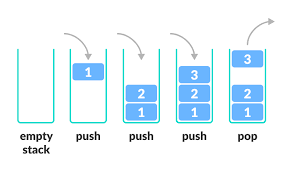
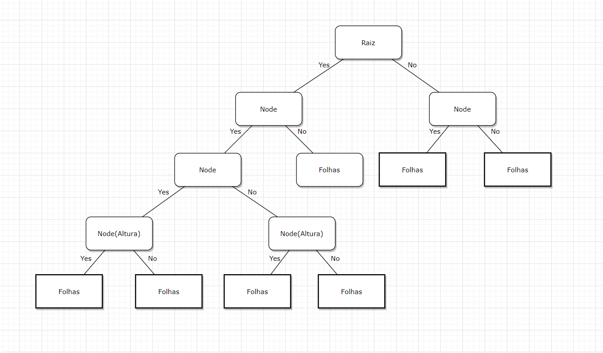

# Estrutura de dados

# Identificar uma estrutura de dados

As estruturas de dados normalmente envolvem a identificação e o desenvolvimento de entidades e operações úteis, e determinam o tipo de problema que pode ser solucionado por meio da sua utilização. Elas também determinam a representação de entidades abstratas e a implementação de operações abstratas que podem ser utilizadas com representações concretas.

# Reconhecer dados heterogêneos e homogêneos

Quando uma estrutura de dados armazena elementos de tipos diferentes, é dito que se trata de uma estrutura de dados heterogênea. Já uma estrutura de dados que armazene somente um tipo de dados é conhecida, então, como de dados homogêneos.

Os dados homogêneos são representados pelos vetores, ou estruturas de dados unidimensionais, e pelas matrizes, estruturas de dados bidimensionais. Veja a seguir uma situação prática de dados heterogêneos e homogêneos.

# Aplicar dados homogêneos (vetores e matrizes) e ponteiros

Codigo em C :

[label](code/Vetor.c)

# Identificar as regras de funcionamento de uma pilha LIFO: last in, first out

Pilha é uma estrutura de dados que admite remoção de elementos e inserção de novos objetos. Sempre que houver uma remoção, o elemento removido é o que está na estrutura há menos tempo.



# Criar funções e procedimentos para uma pilha

Vários softwares utilizados no dia a dia contam com estrutura de dados, porém nem sempre as pessoas se dão conta. Bons exemplos são os softwares aplicativos, como editores de texto, editores de planilhas, etc.​​​​​​​ A estutura de pilhas funciona como se fosse uma pilha de objetos mesmo, ou seja, você insere e retira elementos sempre pelo topo. Veja como.

# Praticar exemplos de utilização de pilhas

Codigo do exemplo em C :
[label](code/DesafioPilha.c)

# dentificar as regras de funcionamento de uma fila: FIFO: First In First Out

Filas são estruturas de dados que armazenam os elementos de forma sequencial (linear). As inserções e retiradas dos elementos são feitas em extremidades diferentes. Existe acesso às duas extremidades: começo, onde é feita a retirada, e término, onde é feita a inserção.

# Criar funções e procedimentos de uma fila

Um item importante a ser estudado sobre filas é a fila de prioridade, que é utilizada em diversas situações.

Em sistemas operacionais:

- No descalonamento de processos para ganhar tempo de processador.
- Na manipulação de interrupções.

Em sistemas:

- Um sistema de filas de transplantes.
- Fila de pouso de aviões (prioridade por combustível disponível).

Portanto, usamos fila de prioridades toda vez que precisar estabelecer uma prioridade de acesso aos elementos.
Na implementação de filas de prioridades, é possível utilizar as mesmas operações das filas tradicionais, ou seja:

- inserção
- remoção
- consulta
- listagem

# Praticar exemplos com a utilização de filas

Codigo em C :

[label](code/Alunos.c)

# Implementar um tipo abstrado de dado para representar árvores binárias



Árvores são estruturas de dados que podem ser implementadas com alocação de memória dinâmica ou estática. Uma árvore binária é um tipo de árvore que possui 0, 1 ou 2 filhos. Neste momento, você verá como se pode construir uma árvore binária usando alocação dinâmica de memória, quais os tipos de árvores binárias e como podemos usar uma árvore para armazenar informações.

Para implementar um tipo abstrato de dado para representar árvores binárias em C, podemos criar uma estrutura que represente cada nó da árvore. Cada nó terá um valor (que pode ser qualquer tipo de dado), um ponteiro para o nó da esquerda e um ponteiro para o nó da direita. A estrutura pode ser definida da seguinte forma:

```C
typedef struct node {
  int value;
  struct node* left;
  struct node* right;
} Node;
```

Para criar a árvore binária, precisamos de um ponteiro para o nó raiz. Podemos definir uma estrutura para a árvore binária que contenha o ponteiro para o nó raiz e qualquer outro dado que queiramos armazenar. A estrutura pode ser definida da seguinte forma:

```C
typedef struct binary_tree {
  Node* root;
  // outros dados que desejamos armazenar
} BinaryTree;
```

Agora, podemos criar funções que manipulem essa estrutura. Por exemplo, podemos criar uma função que insira um novo nó na árvore binária. A função deve receber um ponteiro para a árvore binária e um valor a ser inserido. A função deve criar um novo nó com o valor fornecido e inseri-lo na árvore na posição correta de acordo com a ordem dos valores.

```C
void insert(BinaryTree* tree, int value) {
  Node* new_node = malloc(sizeof(Node));
  new_node->value = value;
  new_node->left = NULL;
  new_node->right = NULL;

  if (tree->root == NULL) {
    tree->root = new_node;
    return;
  }

  Node* current = tree->root;
  while (1) {
    if (value < current->value) {
      if (current->left == NULL) {
        current->left = new_node;
        return;
      } else {
        current = current->left;
      }
    } else {
      if (current->right == NULL) {
        current->right = new_node;
        return;
      } else {
        current = current->right;
      }
    }
  }
}
```

Além da função de inserção, podemos criar outras funções para percorrer a árvore, buscar um valor na árvore, remover um nó da árvore, entre outras. Todas essas funções devem receber um ponteiro para a árvore binária como parâmetro.

É importante lembrar que, ao criar uma árvore binária em C, é necessário tomar cuidado com a alocação de memória. Sempre que criamos um novo nó, devemos alocar memória para ele usando a função malloc() e liberar essa memória quando o nó não for mais necessário usando a função free().

# Aplicar conceitos de representação dinâmica de árvores binárias

A representação dinâmica de árvores binárias é um conceito importante na programação de computadores, pois permite que a estrutura da árvore seja criada, modificada e removida durante a execução do programa. Isso permite que a estrutura da árvore se adapte às necessidades do programa, tornando-a mais flexível e versátil.

Para aplicar conceitos de representação dinâmica de árvores binárias, é necessário utilizar uma estrutura de dados que permita a alocação e liberação de memória de forma dinâmica. Em linguagens de programação como C, isso pode ser feito utilizando ponteiros e alocando memória dinamicamente com as funções malloc() e free().

Uma das maneiras mais comuns de implementar árvores binárias dinâmicas é utilizar uma estrutura que contenha um ponteiro para o nó raiz da árvore e funções para inserir, buscar e remover nós da árvore. Por exemplo, a seguir está um exemplo de implementação de uma estrutura de árvore binária dinâmica em C:

```C
typedef struct TreeNode {
    int data;
    struct TreeNode *left;
    struct TreeNode *right;
} TreeNode;

typedef struct BinaryTree {
    TreeNode *root;
} BinaryTree;

TreeNode *create_node(int data) {
    TreeNode *node = (TreeNode*)malloc(sizeof(TreeNode));
    node->data = data;
    node->left = NULL;
    node->right = NULL;
    return node;
}

void insert_node(TreeNode **root, int data) {
    if (*root == NULL) {
        *root = create_node(data);
        return;
    }

    if (data < (*root)->data) {
        insert_node(&((*root)->left), data);
    } else {
        insert_node(&((*root)->right), data);
    }
}

void remove_node(TreeNode **root, int data) {
    if (*root == NULL) {
        return;
    }

    if (data < (*root)->data) {
        remove_node(&((*root)->left), data);
    } else if (data > (*root)->data) {
        remove_node(&((*root)->right), data);
    } else {
        if ((*root)->left == NULL) {
            TreeNode *temp = (*root)->right;
            free(*root);
            *root = temp;
        } else if ((*root)->right == NULL) {
            TreeNode *temp = (*root)->left;
            free(*root);
            *root = temp;
        } else {
            TreeNode *temp = find_min((*root)->right);
            (*root)->data = temp->data;
            remove_node(&((*root)->right), temp->data);
        }
    }
}

TreeNode *find_min(TreeNode *node) {
    while (node->left != NULL) {
        node = node->left;
    }
    return node;
}
```

Neste exemplo, a estrutura BinaryTree contém um ponteiro para o nó raiz da árvore, e as funções insert_node(), remove_node() e find_min() permitem inserir, remover e buscar nós na árvore dinamicamente. A função create_node() é utilizada para criar um novo nó na árvore.

Com essa implementação, é possível criar, modificar e remover nós da árvore binária dinamicamente durante a execução do programa, tornando-a mais flexível e adaptável às necessidades do programa.

# Identificar exemplos de construção de árvores binárias

Uma árvore binária é uma árvore cujos nós tem dois filhos (alguns vazios) e cada filho é designado como filho à esquerda ou filho à direita. Portanto, a árvore binária tem grau máximo 2. Nó filho ESQUERDO e Nó filho DIREITO. subárvore esquerda e a direita de r, respectivamente, as quais são também árvores binárias
Code :
[label](code/Arvore.c)

# Reconhecer o caminhamento pós-ordem

Existem muitas aplicações em que há a necessidade de realizar o caminhamento em árvores. Este é um método de percurso sistemático que percorre todos os nós de uma árvore, de maneira que cada nó seja visitado uma única vez, em determinada ordem. Uma propriedade importante para o caminhamento é que cada nó seja visitado somente uma vez, e que o tamanho de um caminho seja igual ao número de nó do caminho -1.

Um caminhamento em árvores define uma sequência de nós, desta maneira, cada nó passa a ter um nó seguinte ou um nó próximo, ou ambos, exceto quando a árvore tem somente um nó (nó raiz). A sequência de nós da árvore depende do tipo de caminhamento. Existem diversas formas de percorrer ou caminhar em uma árvore listando seus nós, as principais formas são: pré-ordem (pré-fixada), in-ordem (ordem simétrica) e pós-ordem (pós-fixada).

# Aplicar o caminhamento em pré-ordem

O caminhamento em árvore refere-se ao processo de visitar cada nó em uma estrutura de dados em árvore exatamente uma vez. Geralmente, existem duas abordagens relacionadas a caminhamento de árvore: busca em largura (Breadth-First Search — BFS) e busca em profundidade (Depth-First Search — DFS).

# ​​​​​​​Usar o caminhamento in-ordem

O caminhamento in-ordem de uma árvore binária é um algoritmo de travessia que visita todos os nós da árvore em ordem crescente. Esse algoritmo percorre a árvore da seguinte forma:

1. Visite o nó filho esquerdo recursivamente.
2. Visite o nó raiz.
3. Visite o nó filho direito recursivamente.

Para usar o caminhamento in-ordem de uma árvore binária, siga os seguintes passos:

1. Comece pelo nó raiz da árvore.
2. Verifique se o nó filho esquerdo existe. Se existir, chame o caminhamento in-ordem recursivamente para o nó filho esquerdo.
3. Visite o nó raiz.
4. Verifique se o nó filho direito existe. Se existir, chame o caminhamento in-ordem recursivamente para o nó filho direito.
5. Repita esse processo para cada nó da árvore.

# Identificar as definições de árvores AVL

Uma árvore AVL é uma árvore binária de busca balanceada em altura, o que significa que todas as subárvores esquerda e direita têm alturas que diferem em no máximo uma unidade. Para identificar as definições de árvores AVL, considere as seguintes características:

Fator de Balanceamento: Cada nó da árvore AVL possui um fator de balanceamento, que é a diferença entre as alturas das subárvores esquerda e direita. Se o fator de balanceamento de um nó é maior do que 1 ou menor do que -1, a árvore está desbalanceada e precisa ser reequilibrada.

Rotação: Uma das operações básicas em uma árvore AVL é a rotação, que é usada para reequilibrar a árvore. Existem dois tipos de rotação: rotação simples e rotação dupla.

Inserção e Exclusão: Quando um novo nó é adicionado a uma árvore AVL, o fator de balanceamento de cada nó ao longo do caminho de inserção deve ser atualizado e a árvore pode precisar ser reequilibrada. Da mesma forma, quando um nó é removido, a árvore deve ser reequilibrada para manter as propriedades da árvore AVL.

Altura da Árvore: Em uma árvore AVL, a altura da árvore é limitada superiormente por O(log n), onde n é o número de nós na árvore. Isso significa que as operações de inserção, exclusão e busca têm complexidade de tempo O(log n).

Em resumo, uma árvore AVL é uma árvore binária de busca balanceada em altura, onde cada nó tem um fator de balanceamento que é mantido em uma faixa limitada por meio de rotações e outras operações de reequilíbrio. A altura da árvore é limitada superiormente por O(log n), tornando as operações de árvore eficientes em termos de tempo.

# Reconhecer os conceitos de árvores AVL — rotação direita e esquerda

As rotações esquerda e direita são operações básicas utilizadas em árvores AVL para manter a árvore balanceada.

A rotação direita é usada para balancear uma árvore AVL quando um nó em sua subárvore esquerda é adicionado ou removido. Consiste em "girar" a árvore em torno do nó desequilibrado, transferindo um nó da subárvore esquerda para a subárvore direita.

Por exemplo, na árvore AVL abaixo, o nó A tem um fator de balanceamento de -2, o que indica que sua subárvore esquerda é duas vezes mais alta que a subárvore direita. Para equilibrar a árvore, podemos realizar uma rotação direita em torno do nó A:

```C
     A (-2)
    /     \
   B       C
  / \     / \
 D   E   F   G
```

Após a rotação direita, a árvore fica assim:

```C
     C (0)
    /     \
   A (0)   G
  / \
 B   F
  \
   D
    \
     E
```

Agora, a árvore está balanceada, e a altura da subárvore esquerda e direita do nó A é a mesma.

A rotação esquerda é usada para balancear uma árvore AVL quando um nó em sua subárvore direita é adicionado ou removido. Consiste em "girar" a árvore em torno do nó desequilibrado, transferindo um nó da subárvore direita para a subárvore esquerda.

Por exemplo, na árvore AVL abaixo, o nó A tem um fator de balanceamento de 2, o que indica que sua subárvore direita é duas vezes mais alta que a subárvore esquerda. Para equilibrar a árvore, podemos realizar uma rotação esquerda em torno do nó A:

```C
       A (2)
      /     \
     B       C
    / \     / \
   D   E   F   G
```

Após a rotação esquerda, a árvore fica assim:

```C
     B (0)
    /     \
   D       A (0)
        /     \
       E       C
              / \
             F   G
```

Agora, a árvore está balanceada, e a altura da subárvore esquerda e direita do nó A é a mesma.

# Apontar o método Bubblesort

O método Bubblesort é um algoritmo simples de ordenação que compara repetidamente pares adjacentes de elementos em uma lista e os troca se estiverem na ordem errada. O algoritmo percorre a lista várias vezes, comparando e trocando pares de elementos adjacentes, até que a lista esteja completamente ordenada.

O algoritmo funciona da seguinte maneira:

1. Comece comparando o primeiro elemento da lista com o segundo elemento. Se o primeiro elemento for maior do que o segundo, troque os dois elementos.

2. Continue comparando pares adjacentes de elementos da lista até chegar ao final da lista. Nesse ponto, o último elemento da lista estará no lugar certo.

3. Repita os passos 1 e 2 para o restante da lista, até que todos os elementos estejam na ordem correta.

O nome "Bubblesort" vem da ideia de que os elementos maiores "borbulham" para o final da lista à medida que o algoritmo é executado. Embora seja um algoritmo simples, o método Bubblesort pode ser lento para listas grandes e não é frequentemente usado em aplicações do mundo real. No entanto, é uma boa ferramenta didática para ensinar os conceitos básicos de ordenação e algoritmos.

# Identificar o método Selectionsort

O método Selectionsort é um algoritmo de ordenação simples que funciona encontrando o menor elemento na lista e trocando-o com o primeiro elemento. Em seguida, ele encontra o segundo menor elemento e o troca com o segundo elemento da lista, e assim por diante, até que toda a lista esteja ordenada.

O algoritmo funciona da seguinte maneira:

1. Encontre o menor elemento na lista e troque-o com o primeiro elemento.

2. Encontre o segundo menor elemento na lista (isto é, o menor elemento restante) e troque-o com o segundo elemento da lista.

3. Repita esse processo até que toda a lista esteja ordenada.

O método Selectionsort tem uma complexidade de tempo de O(n^2), o que significa que seu desempenho piora drasticamente à medida que a lista fica maior. No entanto, ele é simples de implementar e é uma boa escolha para listas pequenas ou para listas em que o tempo de execução não é uma preocupação crítica.

Embora o método Selectionsort não seja o algoritmo de ordenação mais eficiente, ele é um dos mais simples e pode ser uma boa opção quando a simplicidade é mais importante do que a eficiência. Além disso, ele pode ser útil como um algoritmo de referência para comparar com outros algoritmos de ordenação mais complexos.

# Explicar o método Insertionsort

O método Insertionsort é um algoritmo de ordenação simples que percorre uma lista de elementos e insere cada elemento em sua posição correta na lista já ordenada. O algoritmo é semelhante a como muitas pessoas organizam um baralho de cartas - mantendo uma mão ordenada e adicionando uma carta por vez em sua posição correta.

O algoritmo funciona da seguinte maneira:

1. Comece com um elemento da lista e considere-o como uma lista ordenada de um elemento.

2. Pegue o próximo elemento da lista e insira-o na posição correta na lista ordenada anterior.

3. Repita o passo 2 para todos os elementos restantes na lista.

O método Insertionsort tem uma complexidade de tempo de O(n^2), o que significa que seu desempenho piora drasticamente à medida que a lista fica maior. No entanto, ele é muito eficiente para listas pequenas e é fácil de implementar.

Embora o método Insertionsort não seja o algoritmo de ordenação mais eficiente, ele é um dos mais simples e pode ser uma boa opção quando a simplicidade é mais importante do que a eficiência. Além disso, ele é útil como um algoritmo de referência para comparar com outros algoritmos de ordenação mais complexos.

# Identificar as diferenças entre funções e procedimentos

Em programação, funções e procedimentos são blocos de código que realizam uma tarefa específica. A principal diferença entre eles é que as funções retornam um valor, enquanto os procedimentos não retornam nada.

Funções:

As funções são blocos de código que podem ser chamados em qualquer lugar do programa e geralmente recebem argumentos de entrada. Elas processam esses argumentos e retornam um valor de volta para quem as chamou. As funções são usadas quando você precisa calcular ou manipular um valor específico, e o resultado desse cálculo precisa ser usado em outro lugar do programa.

Exemplo de uma função em Python que calcula a área de um círculo:

```python
def area_do_circulo(raio):
    area = 3.14 * (raio ** 2)
    return area
```

Neste exemplo, a função area_do_circulo() recebe um argumento raio e calcula a área do círculo usando a fórmula 3.14 \* (raio \*\* 2). Em seguida, a função retorna o valor calculado usando a instrução return area.

Procedimentos:

Os procedimentos são semelhantes às funções, mas não retornam nenhum valor. Eles são usados ​​para executar uma sequência de ações ou operações, sem a necessidade de retornar um resultado. Em outras palavras, os procedimentos são usados quando você precisa executar uma tarefa específica que não precisa de um valor de retorno.

Exemplo de um procedimento em Python que imprime a mensagem "Olá, mundo!" na tela:

```python
def imprime_ola_mundo():
    print("Olá, mundo!")
```

Neste exemplo, o procedimento imprime_ola_mundo() simplesmente imprime a mensagem "Olá, mundo!" na tela usando a instrução print().

Resumindo, a principal diferença entre funções e procedimentos é que as funções retornam um valor, enquanto os procedimentos não retornam nada. As funções são usadas quando você precisa calcular ou manipular um valor específico, enquanto os procedimentos são usados ​​para executar uma tarefa específica que não precisa de um valor de retorno.

# Usar variáveis locais e globais

Variáveis locais são aquelas que são definidas dentro de um escopo específico, como uma função ou um bloco de código, e só são acessíveis dentro desse escopo. Já as variáveis globais são aquelas que são definidas fora de qualquer escopo específico e são acessíveis de qualquer lugar do programa.

O uso de variáveis locais e globais depende do contexto e do objetivo do seu código. Em geral, é recomendado usar variáveis locais sempre que possível, pois elas são mais seguras e menos propensas a erros do que as variáveis globais.

As variáveis locais são mais adequadas quando você precisa armazenar um valor temporário que só será usado em um determinado bloco de código. Isso permite que você evite confusão com outros trechos de código que também possam estar usando a mesma variável global.

Por outro lado, as variáveis globais são mais adequadas quando você precisa armazenar um valor que será usado em várias partes do seu programa. Isso pode ajudar a simplificar seu código, tornando-o mais fácil de ler e entender.

Em resumo, a escolha entre o uso de variáveis locais e globais depende do contexto e do objetivo do seu código. É importante sempre buscar a solução que ofereça mais clareza e segurança para o seu programa.

# Reconhecer um TAD do tipo lista e descrever os elementos de uma lista

Um TAD (Tipo Abstrato de Dados) do tipo lista é uma estrutura de dados que armazena elementos em uma sequência ordenada. Cada elemento da lista é associado a um índice ou posição única na lista. Existem diferentes implementações de listas, como listas encadeadas, listas duplamente encadeadas e listas circulares.

Para reconhecer um TAD do tipo lista, é necessário identificar as seguintes características:

1. A lista tem um tamanho variável: A lista pode crescer ou encolher dinamicamente à medida que novos elementos são adicionados ou removidos.

2. A lista é composta de elementos: Os elementos podem ser de qualquer tipo, como números, strings, objetos, entre outros.

3. A lista tem uma ordem: A ordem dos elementos na lista é importante e é mantida em todos os momentos.

4. Os elementos da lista são acessados por índice: Cada elemento na lista tem uma posição única associada a ele, geralmente um índice numérico. Isso permite que os elementos sejam acessados de forma eficiente.

Se uma estrutura de dados tiver essas características, é muito provável que seja um TAD do tipo lista.

# Identificar formas de armazenamento em uma lista

Uma lista encadeada é uma estrutura de dados que armazena uma coleção de elementos, onde cada elemento é chamado de nó (ou célula) e contém um valor e um ponteiro para o próximo nó da lista. A lista encadeada pode ser simplesmente encadeada (cada nó tem um único ponteiro para o próximo nó) ou duplamente encadeada (cada nó tem um ponteiro para o próximo e outro para o nó anterior).

As principais operações que podem ser realizadas em uma lista encadeada são:

- Inserção de um novo nó no início ou no final da lista
- Remoção de um nó da lista
- Busca por um nó com um determinado valor
- Percorrer a lista para exibir seus elementos

Em linguagens de programação como C, C++ e Java, é comum utilizar ponteiros para implementar uma lista encadeada. Já em linguagens como Python e JavaScript, pode-se usar objetos e referências para implementar essa estrutura de dados.

# Identificar o uso de uma lista encadeada dupla

Uma lista encadeada dupla é uma estrutura de dados na qual cada nó possui um ponteiro para o nó anterior e um ponteiro para o próximo nó da lista. Isso permite que a lista seja percorrida tanto em ordem direta quanto em ordem inversa, tornando-a mais versátil do que uma lista simplesmente encadeada.

- Quando é necessário percorrer a lista tanto em ordem direta quanto em ordem inversa.
- Quando é necessário inserir ou remover elementos no início ou no final da lista com frequência.
- Quando é necessário implementar uma pilha ou uma fila com operações de inserção e remoção em ambas as extremidades.

# Reconhecer a navegação em uma lista encadeada dupla para inserir, remover, atualizar e consultar valores

Em uma lista encadeada dupla, cada nó possui um ponteiro para o nó anterior e outro para o próximo nó da lista, permitindo que a navegação na lista possa ser feita em ambas as direções.

Para inserir um novo nó na lista, é preciso navegar até a posição onde o novo nó deve ser inserido. Se a lista estiver vazia, basta criar um novo nó e apontar o ponteiro head da lista para ele. Se a lista já contiver elementos, é preciso ajustar os ponteiros do nó anterior e do nó seguinte para que apontem para o novo nó.

Para remover um nó da lista, é necessário localizá-lo na lista e ajustar os ponteiros do nó anterior e do nó seguinte para que apontem diretamente um para o outro, eliminando assim o nó que se deseja remover.

Para atualizar o valor de um nó na lista, é preciso localizá-lo na lista e atualizar o valor armazenado nele.

Para consultar um valor na lista, é preciso navegar pelos nós da lista, comparando o valor desejado com o valor armazenado em cada nó, até encontrar o nó que contém o valor desejado ou chegar ao final da lista, indicando que o valor não está presente na lista.

Em geral, a navegação em uma lista encadeada dupla pode ser realizada de forma similar à navegação em uma lista simplesmente encadeada, com a adição de ponteiros para o nó anterior que permitem a navegação em ordem inversa. No entanto, a atualização e remoção de nós podem ser um pouco mais complexas devido à necessidade de atualizar os ponteiros para o nó anterior e o nó seguinte.

Exemple code : [Code](code/ListaDuplamenteEncadeada.c)

# Declarar uma lista dinâmica construir funções de manipulação de uma lista dinâmica

Uma lista dinâmica é uma estrutura de dados que permite a inserção e remoção de elementos de forma flexível e eficiente. Ao contrário de uma lista estática, que tem um tamanho fixo, uma lista dinâmica pode crescer ou encolher à medida que elementos são adicionados ou removidos.

Uma lista dinâmica geralmente é implementada como uma lista encadeada, onde cada elemento da lista armazena um valor e um ponteiro para o próximo elemento da lista. Quando um novo elemento é adicionado, um novo nó é criado e o ponteiro do último elemento da lista é atualizado para apontar para o novo nó. Quando um elemento é removido, o ponteiro do nó anterior é atualizado para apontar para o próximo nó na lista.

O uso de uma lista dinâmica pode tornar o código mais eficiente e flexível, uma vez que evita a necessidade de redimensionar manualmente uma lista estática, além de permitir a inserção e remoção de elementos sem afetar os outros elementos da lista.
