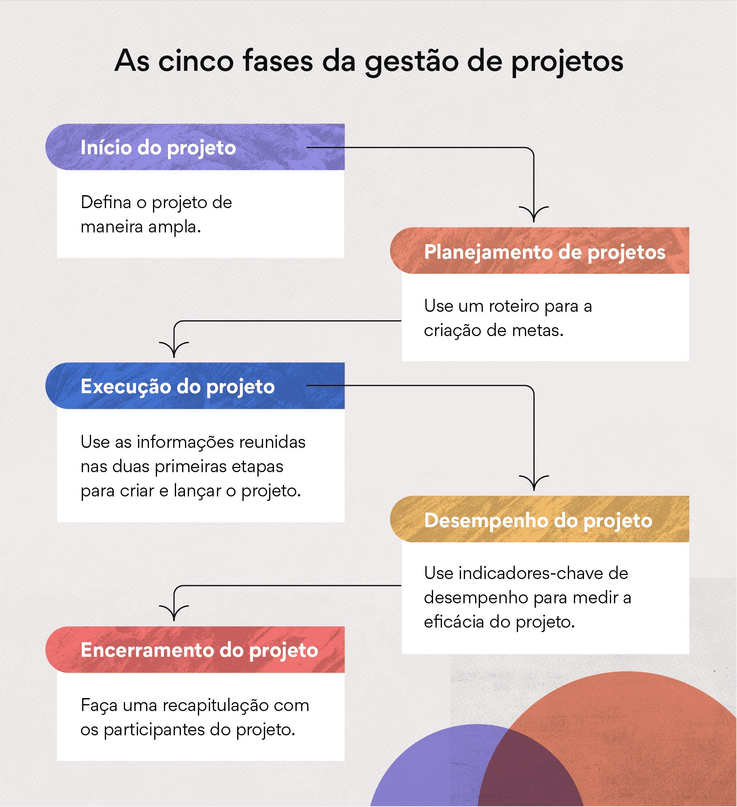

# Gestao de Projetos

<!--
1º Webconference: 27/08 10h as 10h40 ON-LINE

2º Webconference: 17/09 10h as 10h40 ON-LINE -->

<!-- 3º Webconference: 23/09 18h as 18h40 ON-LINE-PLANTÃO -->

<!-- SIMULADO: 03/09/22 a 17/09/22 -->

<!-- Entrega do Trabalho: até 27/09/22 -->
<!--
    Finalização dos exercícios e desafios da trilha: até 01/10/22

 

    Prova Presencial: 01/10 – 03/10 – 04/10
    Prova Final Presencial: 08/10 – 10/10 -->

`OBJETIVOS GERAIS`

Compreender conceitos e técnicas de gerenciamento de projetos, além de suas aplicações como instrumentos práticos para as organizações contemporâneas;
Desenvolver as habilidades necessárias para gerenciamento de projetos relacionados ao cotidiano do gestor de projeto.

`CONTEÚDOS`

`Unidade 1`: Introdução ao gerenciamento de projetos

- Gerenciamento de projetos modernos;
- Estratégia da organização e seleção de projeto.

`Unidade 2`: Estimativas de tempo e custo de um projeto

- Definindo o projeto;
- EAP – Estrutura Analítica do Projeto;
- Desenvolvimento do plano de um projeto;
- Redução da duração de um projeto.

`Unidade 3`: Gerenciamento de riscos

- Planejar o gerenciamento de riscos;
- Identificar os riscos;
- Análise quali-quantitativa dos riscos;
- Monitoramento e controle dos riscos;
- Planejamento das respostas aos riscos.

`Unidade 4`: Planejamento de recursos e custos

- Tipos de restrições de recursos;
- Métodos de alocação de recursos;
- Distribuição das atividades;
- Atribuição de trabalho de projeto.

`Unidade 5`: Gerenciamento e monitoramento de projetos

- Gerente de projetos eficaz;
- Gerenciando equipe de projetos;
- Medição e avaliação de progresso e desempenho.

# `Materias e seus pontos principais`

- estimativa das principais diretrizes de um projeto usando metodologias,diagramas e praticas
- diferença entre projeto portfólio e programa
- elaboração de projeto
- analise de riscos no projeto
- planejamento e gestão de recursos e custos no orçamentos
- delegação de tarefas e regras para o projeto ocorre em bom estado

# Reconhecer o que é um projeto e aprender a distingui-lo das demais operações da organização.

Os projetos exigem um gerenciamento de projetos, enquanto que as operações exigem gerenciamento de processos de negócios. Projeto e operação diferem-se principalmente pelo fato de que o primeiro é temporário, enquanto a operação é contínua e produz produtos, serviços ou resultados repetitivos.

# Identificar as fases do ciclo de vida de um projeto.

O ciclo de vida de um projeto é uma série de fases pelas quais o projeto passa desde seu início até a sua conclusão. O ciclo de vida do projeto é constituído pelas fases: o início do projeto; a organização e preparação; a execução e controle do trabalho do projeto, e; o encerramento do projeto.

# Discutir a importância do gerenciamento de projetos e sua relevância na atualidade.

Por que é importante fazer gestão de projetos? A gestão de projetos é fundamental para reduzir os riscos de fracasso e controlar todas as etapas envolvidas, bem como garantir a qualidade dos resultados. Assim, é possível gerenciar projetos de forma eficiente, ou seja, atingindo os objetivos e otimizando recursos.

# Explicar a estratégia de organização e seleção de projetos.

- A Estratégia de Execução de Projetos (PES) é a abordagem estratégica que descreve a execução das tarefas necessárias para concluir um projeto. Ela costuma ser desenvolvida pelos líderes do projeto juntamente com um ou mais representantes do cliente.

- é a maneira de conquistar bons resultados, superando a concorrência e driblando outras ameaças que possam surgir pelo caminho. Esse processo engloba o planejamento e a execução das ações a fim de que a empresa obtenha um crescimento sustentável.

# Demostrar uma visão geral do processo de planejamento estratégico.

- Determinar objetivos a longo termo. Analisar os fatores internos que causam as questões mais importantes. Gerar opções de estratégicas que abordem essas questões, as priorizando. Decidir entre as opções.

- O objetivo do planejamento estratégico é dar forma aos negócios e produtos de uma empresa, de modo que eles possibilitem os lucros e o crescimento almejados.

- A ideia central é pensar antecipadamente o que será preciso alcançar no futuro e criar um documento que servirá como um guia para cumprir os objetivos do negócio. Esse tipo de planejamento, que é feito a nível corporativo, com os líderes ou proprietários da empresa, é conhecido como planejamento estratégico.

# Discutir a necessidade de um sistema de gerenciamento de portfólios de projetos efetivos.

- A gestão de portfólio de projetos é relevante para as empresas por um simples motivo: ela ajuda gestores a visualizarem e analisarem os projetos como um todo. Assim fica mais fácil controlar e direcionar cada plano organizacional para que eles continuem como um bom exemplo de práticas de administração

- O gerenciamento de portfólio de projetos faz com que você segmente o planejamento estratégico em etapas de acordo com o porte da empresa ou a área do mercado. A partir disso, é possível ter visões rápidas de cada projeto e associá-los a objetivos estratégicos, focados no aumento do Retorno sobre o Investimento (ROI).

# Explicar o método estruturado para a coleta seletiva de informações sobre o projeto.

Como funciona a coleta seletiva? Para ter sucesso na implantação de um projeto de coleta seletiva é importante ter planejamento, verificar e promover parcerias com fornecedores para reaproveitamento dos resíduos. É relevante também o treinamento periódico de educação ambiental para ter uma equipe envolvida com a causa.

• Justificativa do projeto
• Descrição do projeto
• Objetivos do projeto
• Entrega do projeto
• Marcos
• Requisitos técnicos
• Limites e exclusões
• Premissas
• Riscos
• Orçamento (pelo menos o macro)
• Verificações com o cliente
• Gerente do projeto

# Discutir a elaboração do escopo do projeto.

- Quais os limites do projeto?
- Quais passos serão necessários para tirar o projeto do papel?
- Quem será responsável por atividades críticas?
- Como o trabalho da equipe do projeto será verificado e aprovado?
- Caso seja necessário realizar alguma alteração, como será o controle de mudanças?

[site explicando melhor](https://www.euax.com.br/2018/12/fazer-escopo-de-projeto/)

# Analisar o método de elaboração de escopo baseado na EAP (estrutura analítica do projeto).

- EAP por fases: organiza o projeto pelas fases do ciclo de vida do projeto.
- EAP por entregas: organiza o projeto pelos produtos que devem ser gerados.
- EAP por subprojetos: organiza o projeto a partir dos “miniprojetos” dentro dele.
- EAP por equipe: organiza o projeto pela relação de pessoas envolvidas no projeto.
- EAP híbrida: considera diversos aspectos do projeto ao mesmo tempo.

`Para facilitar, siga essa ordem:`

1. Escreva o nome do seu projeto. Por exemplo: Casa Nova.

2. Escolha uma das formas de organizar a EAP citadas anteriormente. Essa decisão dependerá do tipo e da complexidade do projeto. Nesse caso, escolhemos a EAP híbrida. Mas você deverá optar pelo formato que fizer mais sentido para você.

3. Identifique o conjunto das entregas do projeto, que na EAP é chamado de pacote de entregas. Essa visão do projeto em entregas facilita a identificação de algum ponto faltante para entregar os objetivos definidos no Termo de Abertura.

4. Decomponha o trabalho do projeto em pacotes de trabalho (conjunto de atividades), mais facilmente gerenciáveis. Lembre-se que os pacotes de trabalho ainda não são as atividades do projeto, as atividades do projeto serão detalhadas no cronograma.

5. Você pode identificar cada item da EAP com um código identificador numérico, isso vai ajudar no dicionário da EAP ou outros pontos do detalhamento do escopo.

[explicaçao detalhada](https://www.euax.com.br/2019/02/como-fazer-uma-eap/)

# Discutir os fatores que influenciam a qualidade das estimativas.

Os quatro principais fatores que influenciam os projetos são:

- tempo
- custo
- escopo
- qualidade

[qualidade das estimativas do projeto na pratica](https://www.itmplatform.com/br/blog/12-fatores-chave-para-a-rentabilidade-dos-projetos/)

# Identificar as diretrizes para estimar tempo, custos e recursos.

- Plano de Gerenciamento do Cronograma
- Definição das atividades
- Sequenciamento das atividades
- Estimativa dos recursos das atividades
- Estimativa das durações das atividades
- Desenvolvimento do cronograma do projeto
- Controle do cronograma do projeto

`Custos`

A estimativa dos custos envolve desenvolver uma estimativa dos custos dos recursos necessários a implementação das atividades do projeto. No custo aproximado, o estimante considera as causas da variação da estimativa final para a melhor proposta de gerenciamento do projeto.

`tempo`

- Compreenda o que é necessário.
- Priorize atividades e tarefas.
- Decida quem você precisa envolver.
- Faça suas estimativas.
- Use uma variedade de métodos de estimativa para obter as estimativas de tempo mais precisas.

`recursos`

Para estimar o custo de uma atividade deve-se considerar todos os recursos a serem usados na mesma. Esses recursos podem ser mão-de-obra, materiais, equipamentos, entre outros. Podendo ser recursos diretos, como horas trabalhadas e receita, ou recursos indiretos, como salários e aluguel da área de trabalho

# Descrever as metodologias, ferramentas e técnicas para estimar custos e tempo em projetos.

- Estimativas análogas: da experiência a prática
- Estimativa de três pontos: trabalhando com cenários
- Estimativa paramétrica: mais dados, mais precisão

O processo de estimativa de recursos e durações estão interligados e dependem de informações como: escopo de trabalho da atividade do cronograma, tipos de recursos necessários, estimativas das quantidades de recursos e calendários com as disponibilidades de recursos.

# Identificar, a partir dos pacotes de trabalho, os processos fundamentais para a elaboração do plano de um projeto.

- Iniciação
- Planejamento
- Execução
- Monitoramento e controle
- Encerramento

[Detalhes das etapas acima](https://artia.com/blog/5-etapas-de-um-projeto-saiba-quais-sao-e-o-que-se-faz-em-cada-uma-delas/)

# Definir e explorar a elaboração de diagramas de redes de um projeto.

O diagrama de redes é utilizado de maneira a mostrar o caminho crítico do projeto. O caminho crítico serve para determinar o caminho com a maior duração, isso nos ajuda a identificar a data de finalização do projeto.

Um Diagrama de Rede é uma maneira gráfica de exibir tarefas, dependências e o caminho crítico do seu projeto. Caixas (ou nós) representam tarefas e dependências aparecem como linhas que conectam essas caixas.

O Diagrama de Rede é uma ferramenta que organiza o sequenciamento das atividades que precisam ser realizadas para se concluir um projeto.

Outra utilidade do diagrama de rede é apresentar o progresso do projeto e também permitir compactar o cronograma, em caso de prováveis atrasos, encurtando a duração de atividades restantes, que sejam possíveis de ser realizadas em menos tempo. Isso permitirá concluir dentro do prazo.

- Término para início (TI): A atividade anterior deve ser finalizada antes da sucessora.
- Início para início (II): A atividade anterior deve ser iniciada antes que a sucessora inicie.
- Término para término (TT): A atividade predecessora deve ser finalizada antes que a sucessora finalize .
- Início para término (IT): A atividade deve ser iniciada antes que a próxima finalize.

`Além disso, existem 4 tipos de dependências entre as atividades em um projeto:`

- Dependência Obrigatória: É obrigatória pela natureza do trabalho ou especificada em contrato. Por exemplo: Para levantar as paredes de uma casa, primeiro é preciso construir o alicerce.
- Dependência Condicional: A forma que a empresa escolhe para executar seu trabalho. No mesmo exemplo da construção de uma casa, é quando o empreiteiro determina que para começar a azulejar a parede é preciso esperar o cimento secar por 4 dias, para depois colocar a argamassa que vai fixar os azulejos.
- Dependência Externa: São baseadas em necessidades externas, como regras do governo ou de fornecedores.
- Dependência Interna: São baseadas nas necessidades do projeto e podem ser definidas pela própria equipe.

# Explicar as metodologias, ferramentas e técnicas para o sequenciamento das atividades de um projeto.

- Sequenciar as atividades: O processo de identificação e documentação dos relacionamentos entre as atividades do projeto. Estimar os recursos da atividade: O processo de estimativa dos tipos e quantidades de material, pessoas, equipamentos ou suprimentos que serão necessários para realizar cada atividade.

- Como ferramentas e técnicas para o sequenciamento das atividades, o Guia PMBOK (2013) sugere o método do diagrama de procedência (MDP); a determinação de dependência; e a utilização de antecipação e esperas

- **O sequenciamento das atividades de um projeto tem por finalidade identificar e documentar as relações de dependência entre as ações necessárias para concluir cada uma das entregas (deliverables) previstas.Como se sabe, para facilitar o gerenciamento do projeto, o caminho indicado é partir do escopo (soma total de todos os produtos do projeto e seus requisitos) e dos seus principais deliverables e compor a EAP (estrutura analítica do projeto).Depois de elaborada, a EAP deve ser dividida em atividades, e estas sequenciadas, obedecendo o plano de ação definido para o projeto.**

`Método do diagrama do nó`

- Término para início (TI): utilização mais comum, onde uma atividade sucessora não pode começar até que uma atividade predecessora tenha terminado. “Por exemplo: o teste da iluminação do galpão (sucessora) não pode começar até que a atividade de instalar o sistema de iluminação (predecessora) termine”, lembra o consultor.

- Término para término (TT): uma atividade sucessora não pode terminar até que a atividade predecessora tenha terminado.

- Início para início (II): uma atividade sucessora não pode ser iniciada até que uma atividade predecessora tenha sido iniciada. É o caso da elaboração da ata (sucessora), que não pode ser iniciada até que a reunião (predecessora) seja iniciada.

- Início para término (IT): uma atividade sucessora não pode ser terminada até que uma atividade predecessora tenha sido iniciada. Exemplo: o primeiro turno do plantão de um profissional de service desk (sucessora) não pode terminar até que o segundo turno de um profissional de service desk (predecessora) comece.

`Relacionamentos lógicos entre atividades`
`Técnicas de Antecipação e Espera`

Na técnica de antecipação, como o próprio nome diz, não é preciso esperar terminar totalmente a predecessora para começar a sucessora.
`Tipos de Dependências do Sequenciamento das atividades`

Como ferramentas e técnicas para o sequenciamento das atividades, o Guia PMBOK (2013) sugere o método do diagrama de procedência (MDP); a determinação de dependência; e a utilização de antecipação e esperasSérgio Ricardo do Nascimento

As dependências podem ser definidas basicamente como mandatórias ou arbitrárias, externas ou internas.

`Rede Fechada`

Independentemente do método utilizado, é fundamental garantir que a rede do projeto esteja ‘fechada’.

Ou seja, que todas as atividades tenham ao menos uma predecessora e uma sucessora, exceto a primeira atividade do projeto que não terá predecessora e a última atividade do projeto que não terá sucessora.

`Colaboração técnica`

# Analisar as melhores práticas e processos de gerenciamento de riscos, desde a identificação até a resposta dos riscos.

No setor alimentício, podemos citar como exemplos:

- perdas de estoque ou de fornecedores;
- perdas de receitas;
- elevação de custos;
- sazonalidade;
- perda de funcionários importantes;
- fraudes de colaboradores ou terceiros;
- má gestão das contas;
- dificuldades logísticas na distribuição;
- acidentes de trabalho; entre outros.

1. Planejamento

2. Identificação dos riscos

3. Análise qualitativa

4. Análise quantitativa

5. Planejamento das respostas

6. Implementação das respostas

7. Monitoramento dos riscos

`Finalidade`

- identificar e administrar os riscos
- aproveitar oportunidades
- otimizar os recursos

# Discutir os passos necessários para o adequado gerenciamento de riscos em projetos.

`Tipos de riscos`

- Riscos conhecidos vs. riscos desconhecidos
- Riscos negativos vs. riscos positivos
- Riscos individuais vs. riscos gerais

`como fazer o gerenciamento dos riscos`

- Planeje o gerenciamento dos riscos
- Identifique os riscos
- Realize a análise **qualitativa** dos riscos
- Realize a análise **quantitativa** dos riscos
- **_Planeje as respostas aos riscos_**
  - Gerência de crises: apagar incêndios e endereçar os riscos somente depois que se tornam problemas.
  - Conserto de falhas: detectar e reagir aos riscos rapidamente, mas só depois que eles acontecem.
  - Mitigação de riscos: planejar antecipadamente os recursos, mas sem fazer nada para eliminar os riscos.
  - Prevenção: implementar e executar um plano como parte da gestão do projeto para identificar e prevenir os riscos antes que eles se tornem problemas.
  - Eliminação das causas: identificar e eliminar os fatores que geram os riscos.
  - Aceitação: reconhecer e assumir os riscos, sem tomar nenhuma ação sobre eles.
- Implemente respostas aos riscos e testa
- Monitore os riscos

# Desenvolver uma percepção sistêmica das implicações do gerenciamento de riscos no sucesso dos projetos.

O que é percepção de risco Quais os principais influenciadores de percepção de risco?
A percepção de risco é a capacidade de identificar os riscos existentes no ambiente e agir para evitar a ocorrência de acidentes. É, por exemplo, identificar o risco de dirigir alcoolizado, sem cinto de segurança ou em alta velocidade. São situações cujos fatores podem desencadear um acidente.

# Analisar os processos de respostas a riscos e controle de riscos.

Quais são os tipos de respostas ao risco? No âmbito da gestão de projetos, existem vários tipos de respostas associadas ao risco. As principais delas são: -

- eliminar
- transferir
- aceitar
- mitigar (quando falamos em ameaças)
- explorar
- aumentar
- aceitar
- compartilhar (tratando-se de oportunidades)

# Explicar os conceitos essenciais de riscos, como plano de contingência e reservas.

`Contingência`
Contingência é uma eventualidade, um acaso, um acontecimento que tem como fundamento a incerteza de que pode ou não acontecer, é a característica daquilo que é contingente, ou seja, que é duvidoso, possível, mas incerto, que pode ocorrer, mas não necessariamente.

`Reserva de Gerenciamento`

- Para os Riscos Desconhecidos é previsto uma Reserva de Gerenciamento. Trata-se de calcular uma margem de segurança para garantir que riscos que ainda não foram identificados inviabilizem o projeto.

- Normalmente essa reserva gerencial é calculada com base em um percentual da Estimativa do Projeto acrescida da Reserva de contingência e, ao contrário das reservas de contingência, esta reserva não está nas mãos do Gerente de Projetos, que para utilizá-la, deve pedir autorização para o Patrocinador.

# Discutir as principais categorias de riscos.

Os riscos podem ser classificados como: conhecidos, previsíveis e imprevisíveis. Os riscos conhecidos podem ser descobertos após uma avaliação cuidadosa do plano do projeto, ambiente técnico e do negócio, como por exemplo: prazos irreais, escopo mal definido, ambiente de desenvolvimento ruim.

1. **Desvio de escopo**
   O risco de escopo, também chamado de desvio de escopo, ocorre quando os objetivos iniciais do projeto não são bem definidos. É importante comunicar, desde o princípio, o roteiro do projeto às partes interessadas e ater-se com firmeza a esses parâmetros. Se o escopo não for informado de maneira eficaz, pode ser que as partes interessadas tentem alterar as demandas no decorrer do projeto.

`Como reduzir desvios de escopo:` definir parâmetros claros ajuda a consolidar o escopo do projeto. Encontre um consenso para o escopo e comunique essa visão às partes interessadas, ainda no início do projeto, para diminuir a possibilidade de ocorrerem desvios. Fazer consultas regulares ao progresso também ajudam a manter o projeto alinhado ao escopo original.

2. **Baixo desempenho**
   O risco de desempenho surge quando este não corresponde às expectativas iniciais do projeto. Nem sempre é possível encontrar a causa original do baixo desempenho, mas você pode identificar riscos que possam resultar nisso e buscar formas de evitá-los. Alguns exemplos deste tipo de risco são prazos curtíssimos e falhas de comunicação entre os membros da equipe.

`Como melhorar o baixo desempenho:` antever possíveis riscos de desempenho, ainda no início do planejamento, ajuda na preparação. Utilize um software de gestão de projetos para acompanhar processos em tempo real, planejar o projeto minuciosamente e incentivar uma comunicação aberta entre os membros da equipe.

3. **Custos elevados**
   O risco de custo acontece quando o projeto extrapola o orçamento definido inicialmente. Orçamentos pouco realistas ou falta de cálculos detalhados durante o planejamento são algumas das causas. Por exemplo, quando você está confiante que o projeto será concluído sem consumir todo o orçamento. Uma lista detalhada com os custos de cada elemento do projeto pode ajudar a identificar futuras necessidades.

`Como conter os custos altos:` faça uma estimativa precisa para cada elemento do projeto e se mantenha fiel ao orçamento estipulado. A melhor forma de segui-lo é criar um modelo de planejamento de projeto que esclareça os entregáveis, o escopo e o cronograma. Quando o desenvolvimento do projeto começar, considere agendar verificações regulares para analisar o orçamento e o andamento dos gastos.

4. **Prazos muito curtos**
   O risco de tempo, também chamado de risco de cronograma, significa que as tarefas levarão mais tempo do que o esperado. Cronogramas atrasados podem impactar outros fatores, como orçamentos, datas de entrega e desempenho geral. Trata-se de um risco comum enfrentado por gestores de projetos. Quando você não é responsável por executar pessoalmente todos os aspectos dinâmicos do trabalho, é fácil subestimar, durante o planejamento, o tempo que os membros da equipe levarão para concluir o projeto.

`Como contornar prazos curtos:` para reduzir o risco relacionado aos prazos, faça estimativas generosas do tempo necessário para concluir tarefas e incorpore contingências de tempo. Assim, você terá margem para adaptar o cronograma posteriormente. Também é possível utilizar um Cronograma ou diagrama de Gantt para planejar o seu projeto. Com clareza a respeito dos trabalhos, das dependências entre estes e de possíveis atrasos, os gestores podem se adaptar com flexibilidade aos riscos de tempo conforme surgirem. Entender o ciclo de vida do projeto também ajuda a identificar o tempo que cada tarefa requer.

5. **Recursos escassos**
   O risco de recursos ocorre quando não há recursos suficientes para concluir o projeto. “Recurso” pode se referir a tempo, habilidade, dinheiro ou ferramenta. Os gestores de projetos são responsáveis pela aquisição de recursos para a equipe e por comunicar o status de tais recursos aos membros. A alocação de recursos deve ser feita no início do planejamento, geralmente um ou dois meses antes da execução do projeto, dependendo do tamanho deste.

`Como prevenir a escassez de recursos:` a melhor forma de reduzir este risco é criar um plano de alocação de recursos que otimize a utilização e o impacto deles e ajude a equipe a cumprir metas. Quando você sabe, de antemão, quais são os recursos necessários, a chance de esgotá-los futuramente diminui.

6. **Mudanças operacionais**
   O risco operacional está relacionado a mudanças nos processos da equipe ou empresa. Por exemplo, alterações de funções, mudanças na gestão, ou processos novos aos quais a sua equipe precisa se ajustar. Tais fatores podem gerar distrações, exigir adaptação dos fluxos de trabalho e impactar o cronograma dos projetos.

`Como atenuar imprevistos operacionais:` é impossível prever ou prevenir todos os riscos operacionais, mas se você souber que haverá uma mudança na equipe ou nos processos, poderá reduzir os efeitos adversos da transição. Recorra a reuniões, ferramentas de cronograma e treinamentos para que a sua equipe esteja pronta para a mudança e tenha tempo de se adaptar.

7. **Falta de clareza**
   A falta de clareza pode se manifestar como falhas de comunicação pelas partes interessadas, escopos de projeto vagos ou prazos imprecisos. Isso pode ocasionar falta de visibilidade devido a fragmentação do trabalho, orçamentos extrapolados, atrasos nos prazos, alterações de demanda no projeto, mudança de direção do projeto ou resultados abaixo do esperado.

`Como promover clareza:` ao planejar o projeto, verifique várias vezes as demandas para assegurar-se de estar tudo em ordem. Todos os envolvidos estão em sintonia? Os desenvolvedores estão prontos para a próxima fase? O escopo foi definido de forma clara? Também é importante confirmar se o acesso às informações do projeto está disponível para todos. Com as informações centralizadas numa mesma ferramenta, os participantes poderão acompanhar o avanço do projeto.

# Analisar o planejamento de recursos e custos como componentes essenciais do plano-mestre do projeto.

`Custos`

O planejamento de custos de uma empresa consiste na análise de todos os gastos referentes a produção efetiva da atividade principal do negócio, como aquisição de mercadorias e matérias primas, salários, impostos e outros, com o objetivo de prever esses gastos ao longo do tempo

1 - Planejamento de recursos
2 - Estimativa de custos
3 - Orçamento dos custos
4 - Controle dos custos
5 - Etapa extra: estudo dos custos

`Recursos`

O planejamento de recursos envolve determinar o que é preciso para um projeto, assim é possível assegurar e alocar esses itens com eficiência.

1- Identifique os papeis e os níveis de habilidades que precisam ser envolvidos no projeto
2- Determine a porcentagem ou o FTE (full-time equivalent) necessária para cada função
3- Alinhe os colaboradores com os papeis, considerando suas capacidades e sua disponibilidade
4- Apresente o plano de recursos aos stakeholders
5- Comece a trabalhar no primeiro rascunho do cronograma do projeto

# Discutir a distribuição de atividades e recursos no planejamento do projeto.

- Qual é a disponibilidade de cada recurso?
- Quais são os cronogramas de cada atividade?
- Quantos recursos serão necessários para realizar cada atividade?
- Quem é a pessoa mais adequada para realizar cada atividade com eficácia?

[Leia o blog](https://asana.com/pt/resources/project-management-phases)
[Complemeto do de cima](https://asana.com/pt/resources/resource-management-plan)

# Apontar os benefícios do planejamento de recursos.

1. Melhor controle dos processos de um negócio.
2. Cumprimento do cronograma preestabelecido.
3. Melhora do engajamento da equipe.
4. Acerto na tomada de decisão.
5. Minimização dos riscos.
6. Aumento da rentabilidade.
7. Maior satisfação dos clientes.

# Utilizar o planejamento de recursos para desenvolver uma linha de base de custo do projeto.

A linha de base dos custos é o orçamento do projeto aprovado pelo seu patrocinador no término do planejamento. Ela pode ser gerada através de uma planilha com as Previsões do orçamento ou ainda através do próprio cronograma do projeto usando a visão do nosso template PMO-Custos

`linhas base de um projeto`

- O orçamento do projeto.
- O cronograma do projeto.
- O Termo de Abertura do projeto.

# Analisar o "modelo de cinco fases" para o desenvolvimento de uma equipe.

1. `Formação`
   É o estágio inicial, no qual os membros estão começando a interagir
2. `Tormenta`
   Caracterizado pela ocorrência de diversos conflitos no grupo.
3. `Normatização`
   Começa a haver coesão no comportamento do grupo, tornando os integrantes mais próximos uns dos outros.
4. `Desempenho`
   É o estágio no qual a estrutura do grupo é funcional e aceita, ocorre após o estabelecimento da hierarquia – estágio da tormenta – e das normas – normatização.
5. `Interrupção`
   É o estágio final do desenvolvimento dos grupos temporários, pois prepara o grupo para seu fim.
   Como as atividades deverão ser concluídas e o grupo dissolvido, o foco deixa de ser o desempenho das tarefas e passa para o encerramento dos trabalhos.

# Identificar os fatores situacionais que afetam o desenvolvimento da equipe.

O estímulo que o desenvolvimento de equipes leva pode criar um novo líder dentro da empresa e otimizar o trabalho em times naquele espaço. A liderança e colaboração são dois fatores primordiais para que uma empresa esteja organizada e que cresça juntamente aos seus colaboradores.

D1 – Quando há baixa capacidade e alto comprometimento.
D2 – Quando há baixa e baixo comprometimento.
D3 – Quando há alta capacidade e comprometimento baixou ou variável.
D4 – Quando há alta capacidade e alto comprometimento.

# Descrever os pontos fundamentais na formação de equipes de projetos de alto desempenho.

1. Foco na liderança
2. Comunicação aberta
3. Firmeza no ato de delegar
4. Feedback constante
5. Motivação de funcionários
6. Estratégia clara
7. Diversidade no time
8. Administração de fases críticas
9. Busca por soluções
10. Harmonia entre os colegas

# Discutir pontos-chave do gerenciamento de equipes virtuais de projetos.

1. Antes de tudo: conheça os membros da sua equipe
2. Estimule a comunicação e integração entre o time
3. Defina objetivos e resultados a serem alcançados
4. Adapte o trabalho olhando para a diversidade
5. Delegue tarefas pensando em cada profissional
6. Conte com um espaço de chat em tempo real
7. Tenha um sistema eficiente para o compartilhamento de documentos
8. Apesar da flexibilidade, exija consistência
9. Crie processos padronizados para o trabalho
10. Estimule a motivação de equipes virtuais
11. Promova um senso de comunidade mesmo entre equipes virtuais de trabalho
12. Acompanhe o andamento e mensure a produtividade do time **scrum**

# Identificar as possíveis armadilhas de uma equipe de projetos.

- Cronogramas e necessidades de recursos de forma incompleta e imprecisa:
  - Falta de atividades essenciais;
  - estimativas não realistas sobre duração de tarefas;
  - não considerar a interdependência entre tarefas;
  - não identificar as habilidades necessárias,
  - não estimar horas-pessoa com detalhes suficientes.

# Debater aspectos-chave no gerenciamento de equipes de projetos.

Estas áreas se referem à integração dos diversos elementos-chave de um projeto alguns essenciais, outros facilitadores, quais sejam:

- integração
- escopo
- prazos
- custos
- recursos humanos
- aquisições
- qualidade
- riscos
- comunicação do empreendimento.

# Discutir a necessidade de um monitoramento efetivo do projeto.

- Planejamento facilitado
- Flexibilidade e customização
- Treinamento especial
- informações integradas;
- agilidade na extração de dados, em tempo real;
- integração com a solução completa;
- permite ao gestor acompanhar tanto o andamento do projeto como o status de cada Ordem de Serviço (OS);
- facilidade tanto na criação do orçamento como na verificação da situação de cada orçamento, propiciando a análise comparativa.

# Indicar um sistema unificado de informações para coletar dados e relatar progressos em custo, planejamento e especificações.

Funcionamento do jira so citar todas as funcionalidade de um scrum com uma estrutura analitica de projetos

# Descrever a estrutura geral para um sistema de monitoramento e controle de projeto.

O monitoramento de projetos é feito através da comparação entre o desempenho real e as metas definidas. Ou seja, mede os detalhes relacionados aos projetos (orçamentos, cronogramas, escopo, etc.) em relação às suas metas. Assim, garante que você esteja no caminho certo.

