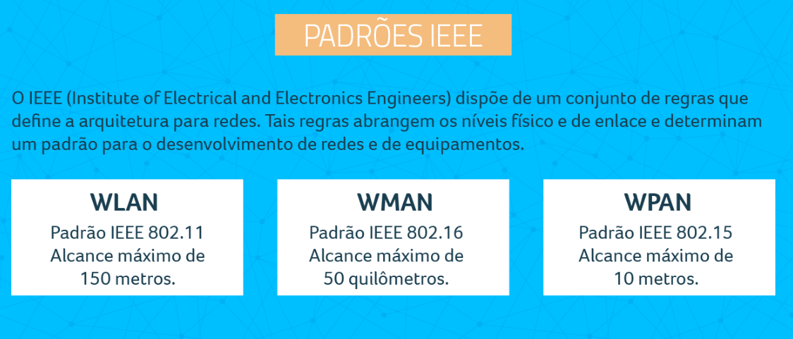
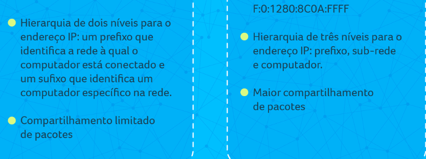

# Materia de redes

<!-- ## Trabalhos e Provas -->

<!-- 1º Webconference: 20/08 9h as 9h40 ON-LINE

2º Webconference: 03/09 8h as 8h40 ON-LINE -->

<!-- 3º Webconference: 24/09 8h as 8h40 ON-LINE -->

<!-- SIMULADO: 03/09/22 a 17/09/22 -->
<!--
    Entrega do Trabalho: até 27/09/22
    Finalização dos exercícios e desafios da trilha: até 01/10/22

 

    Prova Presencial: 01/10 – 03/10 – 04/10
    Prova Final Presencial: 08/10 – 10/10 -->

Os horários e polos para a realização das provas, serão disponibilizados posteriormente.

**_Dicas_**

- Vale a pena olhar as respostas erradas dos exercios

# `Conteudo a ser trabalhado`

- descrever oque e uma rede de computadores e seu tipo protocolos modelos e camadas
- qual ea distancia que cada tipo de rede suporta e usa e `para qual finalidade`
- comutaçao de circuitos e comutaçao de pacotes
- tipologias IEEE
- entendimento sobre ip datagrama (ipv4 X IPv6)
- como funciona ethernet
- tipos de comunicaçao entre dispositivos
- wifi

# Definir o que são redes de computadores.

Redes de computadores referem-se a dispositivos de computação interconectados que podem trocar dados e compartilhar recursos entre si. Esses dispositivos em rede usam um sistema de regras, chamados de protocolos de comunicação, para transmitir informações por meio de tecnologias físicas ou sem fio.

# Reconhecer o breve histórico das redes de computadores.

As redes de computadores surgiram a partir de pesquisas militares no período da Guerra Fria nos EUA. Das redes utilizadas para fins militares até o surgimento da Internet, passaram-se alguns anos. No fim da década de 60, o Departamento de Defesa dos EUA criou uma rede que pudesse resistir a ataques e, no fim da década de 80, um professor de Ciência da Computação criou o World Wide Web, o protocolo que fundou a Internet que conhecemos atualmente.

# Descrever as topologias de redes de computadores.

- Física
  Nada mais, nada menos do que a forma física com que os cabos e dispositivos são conectados. É dessa topologia que falaremos, explicando todas as estratégias de organização, cabeamento e disposição das máquinas.

- Lógica
  Já a lógica examina e organiza a forma como a rede desempenha seu trabalho. Isso quer dizer que os ajustes dependem de uma interface, como softwares, recursos de nuvem, roteadores, e por aí adiante. O objetivo dessa topologia é encontrar a melhor forma de conectar os nodes da rede, estimulando um tráfego ainda mais eficiente.

`Principais topologias de redes`

- Ponto a ponto (Peer-to-peer)
  - PC > Modem < PC 2
- Barramento
  - Cabo Central > PC 1 > Cabo Central > PC 2> Cabo Central> PC 3 > Cabo Central
- Anel
  - PC 1 > PC 2> Servidor > PC 3 > Impressora > PC 4 > PC1
- Estrela
  - PC 2
  - PC 1 > Hub Central < PC 3
  - PC 4
- Malha
  - Reconhecido pela confiabilidade, o padrão em Malha incentiva a conexão de todos os dispositivos entre si. O modelo é usado até mesmo em operações maiores, mas quanto maior o número de dispositivos, maior a complexidade da instalação e o custo em si.
- Árvore
  - Hub Central> Hub Secundário 1> PC 1 e PC 2
  - Hub Central > Hub Secundário 2> PC 3 e PC 4
- Híbrida
  - Por fim, vale lembrar da topologia Híbrida. Como sugere o nome, esse é o padrão que mistura dois ou mais padrões de organização da rede. Por essa versatilidade, esse é o padrão mais utilizado no mercado, justamente por se adaptar ao crescimento das operações, aproveitando o que já está disponível.

**Componentes de uma rede:**
<https://pt.wikipedia.org/wiki/Rede_de_computadores>

# Identificar redes de computadores, protocolos e modelo de camadas.

`Os principais Tipos de redes`

1. LAN – Rede Local
2. MAN – Rede Metropolitana
3. WAN – Rede de Longa Distância
4. WLAN – Rede Local Sem Fio
5. WMAN – Rede Metropolitana Sem Fio
6. WWAN – Rede de Longa Distância Sem Fio
7. SAN – Rede de Área de Armazenamento
8. PAN – Rede de Área Pessoal
9. VPN – Virtual private network
10. RAN – Regional area network

`protocolos e modelo de camadas.`

Saber oque cada tipo de protocolo e é como funciona

- camada de aplicação: WWW, HTTP, SMTP, Telnet, FTP, SSH, NNTP, RDP, IRC, SNMP, POP3, IMAP, SIP, DNS, PING;
- camada de transporte: TCP, UDP, RTP, DCCP, SCTP;
- camada de rede: IPv4, IPv6, IPsec, ICMP;
- camada de ligação física: Ethernet, Modem, PPP, FDDi.

**Modelo de redes:**
<https://www.opservices.com.br/protocolos-de-rede/>

# Reconhecer as classificações de redes de computadores.

# Descrever o modelo cliente-servidor e serviços oferecidos pelas redes.

`Principais caracteristicas do sistema P2P`

- Interface de troca de arquivos seja fora do navegador de Internet.
- Computadores podem servir tanto como servidores como clientes
- Sistemas fáceis de usar e bem integrados.
- O sistema deve incluir ferramentas que ajudam usuários que queiram criar ou adicionar alguma funcionalidade.
- Sistemas que promovam conexão entre usuários
- Sistemas que façam algo novo ou excitante
- Sistemas que atendam a protocolos "cross-network" como SOAP ou XML-RPC

# Formular o conceito para redes de computadores.

Redes de computadores referem-se a dispositivos de computação interconectados que podem trocar dados e compartilhar recursos entre si. Esses dispositivos em rede usam um sistema de regras, chamados de protocolos de comunicação, para transmitir informações por meio de tecnologias físicas ou sem fio.

# Reconhecer o funcionamento das redes de computadores.

- Uma rede de computadores é uma grade que conecta milhares de sistemas de computadores para transferir dados. Esses dispositivos interligados, também conhecidos como nós, enviam, recebem e trocam tráfego de dados, voz e vídeo por meio dos hardwares e softwares que compõem o meio.

- Rede de computadores é uma malha que interliga milhares de sistemas computacionais para a transmissão de dados. Também conhecidos como nós, esses dispositivos interconectados enviam, recebem e trocam tráfego de dados, voz e vídeo, graças ao hardware e software que compõe o ambiente.

`Diferentes aplicaçoes de redes de computadores`

- Compartilhamento de arquivos: permite compartilhar arquivos de dados por meio de uma rede;
- Acesso e utilização de aplicativos: permite acessar e utilizar aplicações através da rede;
- Compartilhar hardware: possibilita aos usuários de uma rede compartilhar dispositivos de hardware, como impressoras e discos rígidos.
- Modelo cliente-servidor: permite que os dados sejam armazenados em servidores, onde os dispositivos do usuário final (clientes) possam acessar essas informações.
- Voz sobre IP (VoIP): permite aos usuários enviar dados de voz por meio de protocolos de Internet;
- Comunicação: pode incluir vídeo, imagens, texto e voz;
- E-commerce: permite aos usuários vender e comprar produtos e serviços pela internet;
- Jogos: permite que usuários joguem simultaneamente, mesmo estando em locais diferentes.

# Identificar os tipos de redes de computadores.

**Funcionamento de uma rede (identificaçao):**
<https://www.ibm.com/docs/pt/i/7.1?topic=networking>

# Diferenciar comutação de circuitos de comutação de pacotes.

As redes locais (LAN) viabilizam a conectividade de vários dispositivos.Cabe destacar a relevância do padrão de redes locais Ethernet, definidas pelos padrões IEEE como exemplo de implementação dos serviços necessários para o funcionamento das redes locais.

`Comutação de circuitos`

- Estabelecimento do circuito: antes que os terminais (telefones) comecem a se comunicar, há a reserva de recurso necessário para essa comunicação, esse recurso é a largura de banda.
- Transferência da voz: ocorre depois do estabelecimento do circuito, com a troca de informações entre a origem e o destino.
- Desconexão do circuito: terminada a comunicação, a largura de banda é liberada em todos os equipamentos de comutação.
- 

`Comutação de pacotes`

A comutação de pacotes é a técnica que envia uma mensagem de dados dividida em pequenas unidades chamadas de pacotes. Ela não exige o prévio estabelecimento de um caminho físico para a transmissão dos pacotes de dados. Os pacotes podem ser transmitidos por diferentes caminhos e chegar fora da ordem em que foram transmitidos.

# Descrever topologias e padrões IEEE.

`Topologias`

**Descrisao de Topologias :**
<https://www.internationalit.com/post/topologia-de-rede-conhe%C3%A7a-os-principais-tipos#:~:text=A%20estrutura%20topol%C3%B3gica%20pode%20ser,apar%C3%AAncia%20ou%20layout%20da%20rede>.

`padrões IEEE`

O padrão IEEE 802.11 define basicamente uma arquitetura para as WLANs que abrange os níveis físico e de enlace. No nível físico são tratadas apenas as transmissões com freqüência de rádio (RF) e infravermelho (IR), embora outras formas de transmissão sem fio possam ser usadas, como microondas e laser, por exemplo.

O projeto IEEE 802 foi iniciado em 1980 com o objetivo de elaborar padrões para redes locais e metropolitanas, primariamente para as camadas 1 (física) e 2 (enlace) do modelo OSI.

# Definir tipos de endereços e enquadramento.

O enquadramento é uma função da Camada de Link de Dados que é usada para separar a mensagem da origem ou do remetente ao destino ou do destinatário ou simplesmente de todas as outras mensagens para todos os outros destinos apenas adicionando o endereço do remetente e o endereço de destino.

enquadramento eo tipo de ip eo numero dele na coonversao exponencial

- ipv4 decimal
- ipv5 hexadecimal

# Definir o esquema de endereçamento IP.

Um bom esquema de endereçamento IP do Azure fornece flexibilidade, espaço para crescimento e integração com redes locais. O esquema garante que a comunicação funcione para recursos implantados, minimiza a exposição pública de sistemas e permite que a empresa tenha flexibilidade na sua própria rede.

# Analisar o endereçamento IPv4.

No IPv4, cada protocolo é composto por quatro grupos de dois dígitos hexadecimais, cada um com 32 bits e variando entre entre 0 e 255. A partir disso são criados números familiares como 192.168.1.1 e 127.0.0.1 – que são usados em redes locais – ou 216.58.202.132, o IP do Google, por exemplo.

# Descrever o endereçamento IPv6.

O crescimento exponencial da internet resultou no esgotamento do protocolo IPv4 e na necessidade de implantação de um novo protocolo, o IPv6. No entanto, como esse processo de transição é complexo, técnicas especiais precisam ser adotadas para permitir a transição gradual dos protocolos IPv4 para IPv6.

# Reconhecer o funcionamento do protocolo Ethernet.

A Ethernet é uma tecnologia de rede capaz de agregar novas tecnologias em uma comunicação compartilhada por um único cabo para todos os dispositivos da rede. Isso permite que a rede se expanda para acomodar novos dispositivos sem ter de modificar os dispositivos antigos.

# Diferenciar os padrões Ethernet.

Ethernet é um padrão de camada física e camada de enlace que opera de forma síncrona em 10 Mbps, com quadros que possuem tamanho variável entre 64 e 1518 bytes. Originalmente foi criado para operar numa topologia em barramento, onde todos os dispositivos recebem todos os pacotes transmitidos.

# Explicar a montagem de uma rede Ethernet.

[tutorial pratico](https://www.asus.com/br/support/FAQ/1044512/)

# Definir o padrão 802.16.

**O padrão 802.16 especifica uma interface sem fio para redes metropolitana**

- Celular – os provedores de acesso por troncos normalmente terceirizam seus serviços, o que é interessante nos casos em que se usam fios. Isso significa que apenas 20% das torres de celulares nos Estados Unidos trabalham com acesso a Internet.

- Banda Larga “on-demand”- existem casos em problemas técnicas dificultam a instalação de sistemas de acesso à Internet por meios convencionais. Isso ocorre, por exemplo, em construções antigas ou em bairros isolados em que não é possível, ou não compensa, investir numa instalação física. Esses pontos de acesso consistem num gargalo para os provedores que deixam de fornecer seus serviços

- Banda Larga Residencial – existem muitas limitações para os pontos em que o acesso via cabo ou DSL pode chegar. Isso significa uma redução de consumidores que poderiam ter acesso à Internet. Com A Adoção de dispositivos que funcionem segundo o padrão 802.16a o custo implantação de pontos de acesso é muito pequeno, aumentando assim a quantidade de clientes que podem usá-los.

- Áreas não servidas – a tecnologia sem fio com o padrão IEEE 802.16a é a solução ideal para acesso à Internet sem fio em zonas rurais, com baixa densidade de população.

- Melhor conexão para os serviços já existentes- com os dispositivos que operam no padrão IEEE 802.16a , pode-se fazer a conexão à Internet mesmo saindo das residências ou escritórios.

`resumo/conclusão`

O uso da estrutura de cabeamento telefônico tradicional ajudou bastante na ampliação da cobertura por banda larga de muitos locais, como no nosso país e no resto do mundo. No entanto existem lacunas que precisam ser cobertas e que só encontram soluções práticas no uso do acesso em banda larga sem fio.

As tecnologias de acesso em banda larga sem fio baseadas nos padrões 802.16 são altamente promissoras, podendo abrir um mercado economicamente viável para operadores, provedores e fabricantes de equipamentos.

# Descrever o funcionamento dos sistemas de comunicação por meio de celulares.

A comunicação entre os diversos dispositivos conectados na sua rede Wi-Fi é feita através de um protocolo, ou seja, uma lingua, que permite a eles reconhecerem as informações uns dos outros (e eliminarem a de outros equipamentos). O padrão utilizado atualmente é o 802.11, que se apresenta em diferentes variações.

`IEEE (Institute of Electrical and Eletronic Engineers)`

`WiMax(Worldwide Interoperability for Microwave Access)`

# Identificar o funcionamento dos sistemas de comunicação por satélite.

O satélite atua como um canal de comunicação entre um dispositivo transmissor e outro receptor. As informações (dados, voz e vídeo) são transmitidas via ondas eletromagnéticas de um dispositivo ao outro, podendo a comunicação ser unidirecional ou bidirecional

# Definir o protocolo TCP e as suas principais características.

As características do protocolo TCP são entregar ordenadamente os datagramas provenientes do protocolo IP, verificar a onda de dados para evitar uma saturação da rede, formatar os dados em segmentos de comprimento variável para 'entregá-los' ao protocolo IP, permitir o multiplex dos dados, ou seja, fazer circular simultaneamente as informações de fontes distintas na mesma linha e permitir o início e o fim de uma comunicação de maneira correta.

- Camada de Enlace

- Camada de Rede (ou Inter-Rede)

- Camada de Transporte

- Camada de Aplicação

# Explicar como ocorre a transmissão de dados utilizando o protocolo TCP.

No TCP-IP, os datagramas gerados na camada de Rede vão ser enviados para a camada inferior, a camada de Interface de Rede (caso estivermos enviando dados) ou a camada de Interface de Rede estará recebendo dados da rede e enviando para a camada de Internet (caso estivermos recebendo dados).

# Descrever o controle de fluxo e de congestionamento.

Para que o controle de fluxo possa ser implementado, são usados Buffers. Um Buffer é um local na memória que armazena pacotes conforme são recebidos. Existem dois buffers para realização de controle de fluxo: uma na camada de transporte do host transmissor, e outro na camada de transporte do host receptor

# Diferenciar os meios de comunicação cabeados.

Meios de transmissão guiados:

- Par trançado
  - redes de telefonias e lan
- Cabo coaxial
  - frequencias altas
- Fibra ótica
  - telecomunicaçao

# Descrever os tipos de comunicação sem fio.

Meios de transmissão sem fio:

- Radiodifusão
  - sinal de radio
- Infravermelho
  - radiação eletromagnética
- Microondas
  - telefone
- Ondas de luz

# Apresentar o cálculo da capacidade de um canal.

Portanto, a capacidade do canal é diretamente proporcional à potência do sinal, como SNR = (Potência do sinal) / (potência do ruído). Assim, por exemplo, uma relação sinal-ruído de 1000 é comumente expressa como: 10 \* log10(1000) = 30 dB. Isso nos mostra as melhores capacidades que os canais reais podem ter.

# Explicar o funcionamento dos switches.

Os switches operam na Camada 2 e reconhecem os endereços MAC dos dispositivos conectados, permitindo filtrar ou encaminhar decisões para cada quadro recebido corretamente. Por outro lado, os roteadores direcionam pacotes IP com base nos endereços IP da Camada 3.

# Descrever as principais características dos switches.

Um switch é um dispositivo que simplesmente conecta todos os elementos da sua rede. Ele atua como ponte ou unidade de controle para que computadores, impressoras, servidores e todos os outros tipos dispositivos possam se comunicar.

- Redução de custos;
- Melhor escalabilidade;
- Aumento da eficiência operacional;
- Maior conectividade e mobilidade;
- Maior segurança cibernética.

# Apresentar a criação de VLANs e suas aplicações.

A VLAN é um protocolo usado para organizar vários dispositivos dentro de uma rede física única sem precisar fazer mudanças físicas na infraestrutura, que são mais caras e demoradas. O termo VLAN significa “Virtual LAN”, sendo que LAN se refere a “Local Area Network” (“rede local”, em tradução livre).

Aplicaçao em redes de internet modernas em emepresas e casa de grandes metropoles

# Analisar as características de tráfego relevantes na definição do QoS.

O QoS (Quality of Service ou Qualidade de Serviço, em português) trata-se de um conjunto de tecnologias funcionando em uma rede para assegurar sua capacidade de executar tráfego de alta prioridade e aplicativos de forma totalmente confiável com capacidade de rede limitada

O QoS (Quality of Service, em inglês) é uma tecnologia presente em roteadores para garantir ao usuário maior controle sobre sua rede Wi-Fi. Por meio da ferramenta, é possível determinar quais dispositivos e serviços terão maior prioridade de conexão.

- Definição do tipo controle
- Definição dos perfis
- Associação dos perfis com o tráfego.

# Reconhecer o protocolo IP e seu datagrama.

O datagrama IP é a unidade básica de dados no nível IP. Um datagrama está dividido em duas áreas, uma área de cabeçalho e outra de dados. O cabeçalho contém toda a informação necessária que identificam o conteúdo do datagrama. Na área de dados está encapsulado o pacote do nível superior, ou seja um pacote TCP ou UDP.

# Relacionar os problemas do IPV4.

Mais uma séria limitação do IPv4 é a falta de uma camada de segurança. Ele foi "desenvolvido para ser usado em redes onde as pessoas confiam umas nas outras" e não em um ambiente anárquico como a internet atual.

# Descrever o protocolo IPV6.

IPv6 é a versão mais atual do Protocolo de Internet. Originalmente oficializada em 6 de junho de 2012, é fruto do esforço do IETF para criar a "nova geração do IP", cujas linhas mestras foram descritas por Scott Bradner e Allison Marken, em 1994, na RFC 1752. Sua principal especificação encontra-se na RFC 2460
